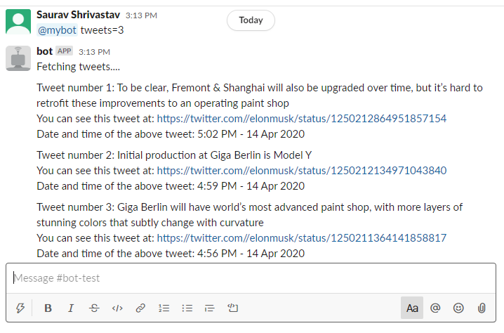

# SlackBot-for-Scrapping-Tweets

The bot scrapes tweets of Elon Musk (it can work for other users as well) and then posts the tweets as a message onto the slack channel. The user can tell the bot about the number of tweets that are supposed to be fetched.

## Version - 1
The version-1 of the bot used the GetOldTweets3 library to fetch tweets directly.

## Version - 2
In the version-2, I've implemented the web scraping by using the BeautifulSoup4 and requests libs.

## Version - 3
The bot now serves a CSV file along with the tweets with all the data.

## Screenshot

## Motivation 
Well thanks to the team of [DSC Thapar](developer-student-club-thapar).

